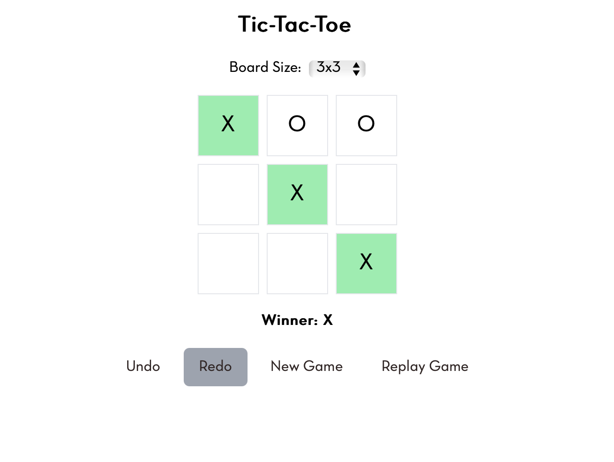

# Tic-Tac-Toe Game

A fully interactive Tic-Tac-Toe game built with **React, TypeScript, Redux Toolkit, and Framer Motion**. The game supports **undo, redo, replay, and configurable board sizes**.



## 🚀 Features
- 🎮 **Two-player game** with alternating turns
- 🏆 **Winner detection** with highlighted winning line
- 🔄 **Undo & Redo functionality**
- ⏪ **Replay past moves** step-by-step
- ⚙ **Configurable board size** (3x3, 4x4, 5x5)
- 🎨 **Smooth animations using Framer Motion**

## 🛠️ Technologies Used
- **React** (with TypeScript)
- **Redux Toolkit** (for state management)
- **Framer Motion** (for animations)
- **Tailwind CSS** (for styling)

## 📦 Installation
```bash
# Clone the repository
git clone https://github.com/your-repo/tic-tac-toe.git
cd tic-tac-toe

# Install dependencies
npm install

# Start the development server
npm run dev
```

## 🎮 How to Play
1. **Select a board size** (3x3, 4x4, or 5x5).
2. Players take turns placing `X` and `O`.
3. **Undo** or **Redo** moves anytime.
4. The game **highlights the winning line** when a player wins.
5. **Replay** previous moves after the game ends.
6. Click **New Game** to restart.

## 📌 Available Scripts
```bash
npm run dev       # Start the development server
npm run build     # Build the project for production
npm run lint      # Run linter to check for errors
npm run test      # Run unit tests
```

## 📜 License
This project is licensed under the **MIT License**.

---
### ✨ Enjoy Playing! 🎉
